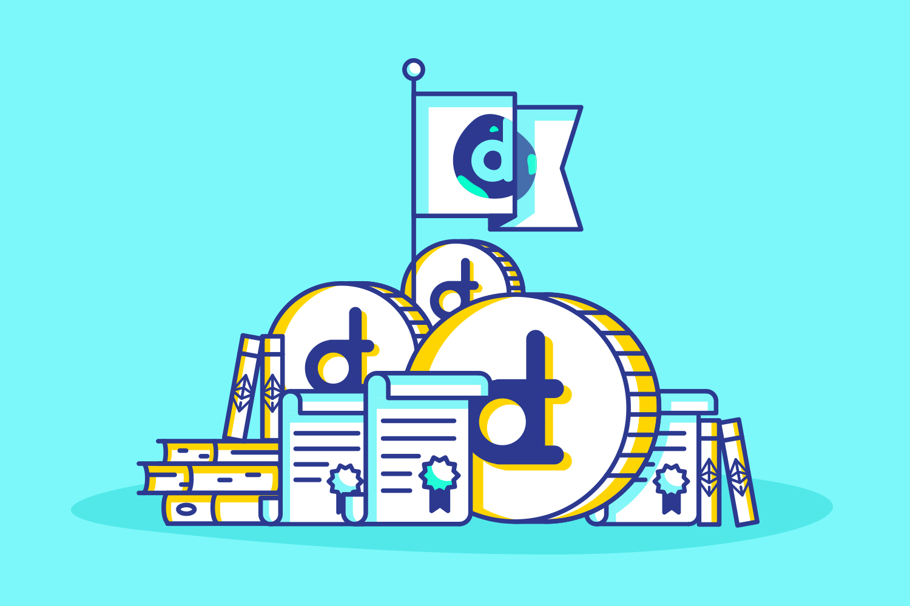

# district0x Network Token 



## ABIs

Contribution:
```json
[{"constant":false,"inputs":[{"name":"_minContribAmount","type":"uint256"}],"name":"setMinContribAmount","outputs":[],"payable":false,"type":"function"},{"constant":true,"inputs":[{"name":"","type":"uint256"}],"name":"advisers","outputs":[{"name":"","type":"address"}],"payable":false,"type":"function"},{"constant":true,"inputs":[],"name":"founder1","outputs":[{"name":"","type":"address"}],"payable":false,"type":"function"},{"constant":true,"inputs":[],"name":"EARLY_CONTRIBUTOR_STAKE","outputs":[{"name":"","type":"uint256"}],"payable":false,"type":"function"},{"constant":true,"inputs":[{"name":"periodIndex","type":"uint256"}],"name":"getContribPeriod","outputs":[{"name":"boolValues","type":"bool[4]"},{"name":"uintValues","type":"uint256[8]"}],"payable":false,"type":"function"},{"constant":true,"inputs":[],"name":"COMMUNITY_ADVISERS_STAKE","outputs":[{"name":"","type":"uint256"}],"payable":false,"type":"function"},{"constant":true,"inputs":[],"name":"ADVISER_STAKE","outputs":[{"name":"","type":"uint256"}],"payable":false,"type":"function"},{"constant":true,"inputs":[],"name":"CONTRIB_PERIODS","outputs":[{"name":"","type":"uint8"}],"payable":false,"type":"function"},{"constant":true,"inputs":[{"name":"_addr","type":"address"}],"name":"isOwner","outputs":[{"name":"","type":"bool"}],"payable":false,"type":"function"},{"constant":true,"inputs":[{"name":"periodIndex","type":"uint256"},{"name":"offset","type":"uint256"},{"name":"limit","type":"uint256"}],"name":"getUncompensatedContributors","outputs":[{"name":"contributorIndexes","type":"uint256[]"}],"payable":false,"type":"function"},{"constant":false,"inputs":[{"name":"_from","type":"address"},{"name":"_to","type":"address"},{"name":"_amount","type":"uint256"}],"name":"onTransfer","outputs":[{"name":"","type":"bool"}],"payable":false,"type":"function"},{"constant":true,"inputs":[],"name":"TEAM_VESTING_CLIFF","outputs":[{"name":"","type":"uint256"}],"payable":false,"type":"function"},{"constant":true,"inputs":[],"name":"EARLY_CONTRIBUTOR_VESTING_CLIFF","outputs":[{"name":"","type":"uint256"}],"payable":false,"type":"function"},{"constant":true,"inputs":[],"name":"wallet","outputs":[{"name":"","type":"address"}],"payable":false,"type":"function"},{"constant":false,"inputs":[{"name":"periodIndex","type":"uint256"}],"name":"cancelContribPeriod","outputs":[],"payable":false,"type":"function"},{"constant":true,"inputs":[],"name":"minContribAmount","outputs":[{"name":"","type":"uint256"}],"payable":false,"type":"function"},{"constant":false,"inputs":[{"name":"i","type":"uint8"},{"name":"softCapAmount","type":"uint256"},{"name":"afterSoftCapDuration","type":"uint256"},{"name":"hardCapAmount","type":"uint256"},{"name":"startTime","type":"uint256"},{"name":"endTime","type":"uint256"}],"name":"setContribPeriod","outputs":[],"payable":false,"type":"function"},{"constant":false,"inputs":[],"name":"emergencyStop","outputs":[],"payable":false,"type":"function"},{"constant":true,"inputs":[],"name":"getConfiguration","outputs":[{"name":"","type":"bool"},{"name":"","type":"uint256"},{"name":"","type":"address"},{"name":"","type":"address"},{"name":"","type":"address"},{"name":"","type":"address"},{"name":"_advisers","type":"address[]"},{"name":"","type":"bool"}],"payable":false,"type":"function"},{"constant":true,"inputs":[],"name":"FOUNDER2_STAKE","outputs":[{"name":"","type":"uint256"}],"payable":false,"type":"function"},{"constant":true,"inputs":[],"name":"CONTRIB_PERIOD2_STAKE","outputs":[{"name":"","type":"uint256"}],"payable":false,"type":"function"},{"constant":true,"inputs":[],"name":"stopped","outputs":[{"name":"","type":"bool"}],"payable":false,"type":"function"},{"constant":false,"inputs":[{"name":"periodIndex","type":"uint256"},{"name":"offset","type":"uint256"},{"name":"limit","type":"uint256"}],"name":"compensateContributors","outputs":[],"payable":false,"type":"function"},{"constant":false,"inputs":[{"name":"contributor","type":"address"}],"name":"contributeWithAddress","outputs":[],"payable":true,"type":"function"},{"constant":true,"inputs":[],"name":"founder2","outputs":[{"name":"","type":"address"}],"payable":false,"type":"function"},{"constant":true,"inputs":[],"name":"earlySponsor","outputs":[{"name":"","type":"address"}],"payable":false,"type":"function"},{"constant":true,"inputs":[],"name":"CONTRIB_PERIOD3_STAKE","outputs":[{"name":"","type":"uint256"}],"payable":false,"type":"function"},{"constant":false,"inputs":[],"name":"release","outputs":[],"payable":false,"type":"function"},{"constant":true,"inputs":[],"name":"LEGAL_ADVISER_STAKE","outputs":[{"name":"","type":"uint256"}],"payable":false,"type":"function"},{"constant":true,"inputs":[{"name":"","type":"uint256"}],"name":"contribPeriodsStakes","outputs":[{"name":"","type":"uint256"}],"payable":false,"type":"function"},{"constant":false,"inputs":[],"name":"enableDistrict0xNetworkTokenTransfers","outputs":[],"payable":false,"type":"function"},{"constant":true,"inputs":[],"name":"tokenTransfersEnabled","outputs":[{"name":"","type":"bool"}],"payable":false,"type":"function"},{"constant":false,"inputs":[{"name":"_operation","type":"bytes32"}],"name":"revoke","outputs":[],"payable":false,"type":"function"},{"constant":true,"inputs":[],"name":"getNow","outputs":[{"name":"","type":"uint256"}],"payable":false,"type":"function"},{"constant":true,"inputs":[{"name":"_operation","type":"bytes32"},{"name":"_owner","type":"address"}],"name":"hasConfirmed","outputs":[{"name":"","type":"bool"}],"payable":false,"type":"function"},{"constant":true,"inputs":[{"name":"ownerIndex","type":"uint256"}],"name":"getOwner","outputs":[{"name":"","type":"address"}],"payable":false,"type":"function"},{"constant":false,"inputs":[{"name":"_to","type":"address"}],"name":"kill","outputs":[],"payable":false,"type":"function"},{"constant":true,"inputs":[{"name":"periodIndex","type":"uint256"},{"name":"contributorAddress","type":"address"}],"name":"getContributor","outputs":[{"name":"","type":"uint256"},{"name":"","type":"bool"},{"name":"","type":"uint256"}],"payable":false,"type":"function"},{"constant":false,"inputs":[],"name":"contribute","outputs":[],"payable":true,"type":"function"},{"constant":false,"inputs":[{"name":"_owner","type":"address"},{"name":"_spender","type":"address"},{"name":"_amount","type":"uint256"}],"name":"onApprove","outputs":[{"name":"","type":"bool"}],"payable":false,"type":"function"},{"constant":true,"inputs":[],"name":"required","outputs":[{"name":"","type":"uint256"}],"payable":false,"type":"function"},{"constant":false,"inputs":[{"name":"_district0xNetworkToken","type":"address"}],"name":"setDistrict0xNetworkToken","outputs":[],"payable":false,"type":"function"},{"constant":true,"inputs":[],"name":"TEAM_VESTING_PERIOD","outputs":[{"name":"","type":"uint256"}],"payable":false,"type":"function"},{"constant":true,"inputs":[],"name":"district0xNetworkToken","outputs":[{"name":"","type":"address"}],"payable":false,"type":"function"},{"constant":true,"inputs":[],"name":"CONTRIB_PERIOD1_STAKE","outputs":[{"name":"","type":"uint256"}],"payable":false,"type":"function"},{"constant":false,"inputs":[{"name":"periodIndex","type":"uint8"}],"name":"enableContribPeriod","outputs":[],"payable":false,"type":"function"},{"constant":true,"inputs":[],"name":"getRunningContribPeriod","outputs":[{"name":"","type":"uint256"}],"payable":false,"type":"function"},{"constant":true,"inputs":[],"name":"EARLY_CONTRIBUTOR_VESTING_PERIOD","outputs":[{"name":"","type":"uint256"}],"payable":false,"type":"function"},{"constant":false,"inputs":[{"name":"_owner","type":"address"}],"name":"proxyPayment","outputs":[{"name":"","type":"bool"}],"payable":true,"type":"function"},{"constant":true,"inputs":[{"name":"","type":"uint256"}],"name":"contribPeriods","outputs":[{"name":"softCapAmount","type":"uint256"},{"name":"afterSoftCapDuration","type":"uint256"},{"name":"hardCapAmount","type":"uint256"},{"name":"startTime","type":"uint256"},{"name":"endTime","type":"uint256"},{"name":"isEnabled","type":"bool"},{"name":"isCancelled","type":"bool"},{"name":"softCapReached","type":"bool"},{"name":"hardCapReached","type":"bool"},{"name":"totalContributed","type":"uint256"}],"payable":false,"type":"function"},{"constant":true,"inputs":[],"name":"FOUNDER1_STAKE","outputs":[{"name":"","type":"uint256"}],"payable":false,"type":"function"},{"inputs":[{"name":"_owners","type":"address[]"},{"name":"_required","type":"uint256"},{"name":"_wallet","type":"address"},{"name":"_founder1","type":"address"},{"name":"_founder2","type":"address"},{"name":"_earlySponsor","type":"address"},{"name":"_advisers","type":"address[]"}],"payable":false,"type":"constructor"},{"payable":true,"type":"fallback"},{"anonymous":false,"inputs":[{"indexed":true,"name":"contribPeriodIndex","type":"uint256"},{"indexed":false,"name":"totalContributed","type":"uint256"},{"indexed":true,"name":"contributor","type":"address"},{"indexed":false,"name":"amount","type":"uint256"},{"indexed":false,"name":"contributorsCount","type":"uint256"}],"name":"onContribution","type":"event"},{"anonymous":false,"inputs":[{"indexed":true,"name":"contribPeriodIndex","type":"uint256"},{"indexed":false,"name":"endTime","type":"uint256"}],"name":"onSoftCapReached","type":"event"},{"anonymous":false,"inputs":[{"indexed":true,"name":"contribPeriodIndex","type":"uint256"},{"indexed":false,"name":"endTime","type":"uint256"}],"name":"onHardCapReached","type":"event"},{"anonymous":false,"inputs":[{"indexed":false,"name":"isStopped","type":"bool"}],"name":"onEmergencyChanged","type":"event"},{"anonymous":false,"inputs":[{"indexed":false,"name":"owner","type":"address"},{"indexed":false,"name":"operation","type":"bytes32"}],"name":"Confirmation","type":"event"},{"anonymous":false,"inputs":[{"indexed":false,"name":"owner","type":"address"},{"indexed":false,"name":"operation","type":"bytes32"}],"name":"Revoke","type":"event"}]
```

DNT:
```json
[{"constant":true,"inputs":[{"name":"_holder","type":"address"}],"name":"tokenGrantsCount","outputs":[{"name":"index","type":"uint256"}],"payable":false,"type":"function"},{"constant":true,"inputs":[],"name":"name","outputs":[{"name":"","type":"string"}],"payable":false,"type":"function"},{"constant":false,"inputs":[{"name":"_spender","type":"address"},{"name":"_amount","type":"uint256"}],"name":"approve","outputs":[{"name":"success","type":"bool"}],"payable":false,"type":"function"},{"constant":true,"inputs":[],"name":"creationBlock","outputs":[{"name":"","type":"uint256"}],"payable":false,"type":"function"},{"constant":true,"inputs":[],"name":"totalSupply","outputs":[{"name":"","type":"uint256"}],"payable":false,"type":"function"},{"constant":false,"inputs":[{"name":"_from","type":"address"},{"name":"_to","type":"address"},{"name":"_value","type":"uint256"}],"name":"transferFrom","outputs":[{"name":"","type":"bool"}],"payable":false,"type":"function"},{"constant":true,"inputs":[{"name":"","type":"address"},{"name":"","type":"uint256"}],"name":"grants","outputs":[{"name":"granter","type":"address"},{"name":"value","type":"uint256"},{"name":"cliff","type":"uint64"},{"name":"vesting","type":"uint64"},{"name":"start","type":"uint64"},{"name":"revokable","type":"bool"},{"name":"burnsOnRevoke","type":"bool"}],"payable":false,"type":"function"},{"constant":true,"inputs":[],"name":"decimals","outputs":[{"name":"","type":"uint8"}],"payable":false,"type":"function"},{"constant":false,"inputs":[{"name":"_newController","type":"address"}],"name":"changeController","outputs":[],"payable":false,"type":"function"},{"constant":true,"inputs":[{"name":"_owner","type":"address"},{"name":"_blockNumber","type":"uint256"}],"name":"balanceOfAt","outputs":[{"name":"","type":"uint256"}],"payable":false,"type":"function"},{"constant":true,"inputs":[],"name":"version","outputs":[{"name":"","type":"string"}],"payable":false,"type":"function"},{"constant":true,"inputs":[{"name":"_holder","type":"address"},{"name":"_grantId","type":"uint256"}],"name":"tokenGrant","outputs":[{"name":"granter","type":"address"},{"name":"value","type":"uint256"},{"name":"vested","type":"uint256"},{"name":"start","type":"uint64"},{"name":"cliff","type":"uint64"},{"name":"vesting","type":"uint64"},{"name":"revokable","type":"bool"},{"name":"burnsOnRevoke","type":"bool"}],"payable":false,"type":"function"},{"constant":false,"inputs":[{"name":"_cloneTokenName","type":"string"},{"name":"_cloneDecimalUnits","type":"uint8"},{"name":"_cloneTokenSymbol","type":"string"},{"name":"_snapshotBlock","type":"uint256"},{"name":"_transfersEnabled","type":"bool"}],"name":"createCloneToken","outputs":[{"name":"","type":"address"}],"payable":false,"type":"function"},{"constant":true,"inputs":[{"name":"holder","type":"address"}],"name":"lastTokenIsTransferableDate","outputs":[{"name":"date","type":"uint64"}],"payable":false,"type":"function"},{"constant":true,"inputs":[{"name":"_owner","type":"address"}],"name":"balanceOf","outputs":[{"name":"balance","type":"uint256"}],"payable":false,"type":"function"},{"constant":true,"inputs":[],"name":"parentToken","outputs":[{"name":"","type":"address"}],"payable":false,"type":"function"},{"constant":false,"inputs":[{"name":"_owner","type":"address"},{"name":"_amount","type":"uint256"}],"name":"generateTokens","outputs":[{"name":"","type":"bool"}],"payable":false,"type":"function"},{"constant":true,"inputs":[],"name":"symbol","outputs":[{"name":"","type":"string"}],"payable":false,"type":"function"},{"constant":false,"inputs":[{"name":"_to","type":"address"},{"name":"_value","type":"uint256"},{"name":"_start","type":"uint64"},{"name":"_cliff","type":"uint64"},{"name":"_vesting","type":"uint64"},{"name":"_revokable","type":"bool"},{"name":"_burnsOnRevoke","type":"bool"}],"name":"grantVestedTokens","outputs":[],"payable":false,"type":"function"},{"constant":true,"inputs":[{"name":"_blockNumber","type":"uint256"}],"name":"totalSupplyAt","outputs":[{"name":"","type":"uint256"}],"payable":false,"type":"function"},{"constant":false,"inputs":[{"name":"_to","type":"address"},{"name":"_value","type":"uint256"}],"name":"transfer","outputs":[{"name":"","type":"bool"}],"payable":false,"type":"function"},{"constant":true,"inputs":[],"name":"transfersEnabled","outputs":[{"name":"","type":"bool"}],"payable":false,"type":"function"},{"constant":true,"inputs":[],"name":"parentSnapShotBlock","outputs":[{"name":"","type":"uint256"}],"payable":false,"type":"function"},{"constant":false,"inputs":[{"name":"_spender","type":"address"},{"name":"_amount","type":"uint256"},{"name":"_extraData","type":"bytes"}],"name":"approveAndCall","outputs":[{"name":"success","type":"bool"}],"payable":false,"type":"function"},{"constant":false,"inputs":[{"name":"_holder","type":"address"}],"name":"revokeAllTokenGrants","outputs":[],"payable":false,"type":"function"},{"constant":true,"inputs":[{"name":"holder","type":"address"},{"name":"time","type":"uint64"}],"name":"transferableTokens","outputs":[{"name":"","type":"uint256"}],"payable":false,"type":"function"},{"constant":false,"inputs":[{"name":"_owner","type":"address"},{"name":"_amount","type":"uint256"}],"name":"destroyTokens","outputs":[{"name":"","type":"bool"}],"payable":false,"type":"function"},{"constant":true,"inputs":[{"name":"_owner","type":"address"},{"name":"_spender","type":"address"}],"name":"allowance","outputs":[{"name":"remaining","type":"uint256"}],"payable":false,"type":"function"},{"constant":true,"inputs":[{"name":"tokens","type":"uint256"},{"name":"time","type":"uint256"},{"name":"start","type":"uint256"},{"name":"cliff","type":"uint256"},{"name":"vesting","type":"uint256"}],"name":"calculateVestedTokens","outputs":[{"name":"","type":"uint256"}],"payable":false,"type":"function"},{"constant":true,"inputs":[],"name":"tokenFactory","outputs":[{"name":"","type":"address"}],"payable":false,"type":"function"},{"constant":false,"inputs":[{"name":"_holder","type":"address"},{"name":"_grantId","type":"uint256"}],"name":"revokeTokenGrant","outputs":[],"payable":false,"type":"function"},{"constant":false,"inputs":[{"name":"_transfersEnabled","type":"bool"}],"name":"enableTransfers","outputs":[],"payable":false,"type":"function"},{"constant":true,"inputs":[],"name":"controller","outputs":[{"name":"","type":"address"}],"payable":false,"type":"function"},{"inputs":[{"name":"_controller","type":"address"},{"name":"_tokenFactory","type":"address"}],"payable":false,"type":"constructor"},{"payable":true,"type":"fallback"},{"anonymous":false,"inputs":[{"indexed":true,"name":"from","type":"address"},{"indexed":true,"name":"to","type":"address"},{"indexed":false,"name":"value","type":"uint256"},{"indexed":false,"name":"grantId","type":"uint256"}],"name":"NewTokenGrant","type":"event"},{"anonymous":false,"inputs":[{"indexed":true,"name":"_from","type":"address"},{"indexed":true,"name":"_to","type":"address"},{"indexed":false,"name":"_amount","type":"uint256"}],"name":"Transfer","type":"event"},{"anonymous":false,"inputs":[{"indexed":true,"name":"_cloneToken","type":"address"},{"indexed":false,"name":"_snapshotBlock","type":"uint256"}],"name":"NewCloneToken","type":"event"},{"anonymous":false,"inputs":[{"indexed":true,"name":"_owner","type":"address"},{"indexed":true,"name":"_spender","type":"address"},{"indexed":false,"name":"_amount","type":"uint256"}],"name":"Approval","type":"event"}]
```

Multisig:
```json
[{"constant":true,"inputs":[{"name":"","type":"uint256"}],"name":"owners","outputs":[{"name":"","type":"address"}],"payable":false,"type":"function"},{"constant":false,"inputs":[{"name":"owner","type":"address"}],"name":"removeOwner","outputs":[],"payable":false,"type":"function"},{"constant":false,"inputs":[{"name":"transactionId","type":"uint256"}],"name":"revokeConfirmation","outputs":[],"payable":false,"type":"function"},{"constant":true,"inputs":[{"name":"","type":"address"}],"name":"isOwner","outputs":[{"name":"","type":"bool"}],"payable":false,"type":"function"},{"constant":true,"inputs":[{"name":"","type":"uint256"},{"name":"","type":"address"}],"name":"confirmations","outputs":[{"name":"","type":"bool"}],"payable":false,"type":"function"},{"constant":true,"inputs":[{"name":"pending","type":"bool"},{"name":"executed","type":"bool"}],"name":"getTransactionCount","outputs":[{"name":"count","type":"uint256"}],"payable":false,"type":"function"},{"constant":false,"inputs":[{"name":"owner","type":"address"}],"name":"addOwner","outputs":[],"payable":false,"type":"function"},{"constant":true,"inputs":[{"name":"transactionId","type":"uint256"}],"name":"isConfirmed","outputs":[{"name":"","type":"bool"}],"payable":false,"type":"function"},{"constant":true,"inputs":[{"name":"transactionId","type":"uint256"}],"name":"getConfirmationCount","outputs":[{"name":"count","type":"uint256"}],"payable":false,"type":"function"},{"constant":true,"inputs":[{"name":"","type":"uint256"}],"name":"transactions","outputs":[{"name":"destination","type":"address"},{"name":"value","type":"uint256"},{"name":"data","type":"bytes"},{"name":"executed","type":"bool"}],"payable":false,"type":"function"},{"constant":true,"inputs":[],"name":"getOwners","outputs":[{"name":"","type":"address[]"}],"payable":false,"type":"function"},{"constant":true,"inputs":[{"name":"from","type":"uint256"},{"name":"to","type":"uint256"},{"name":"pending","type":"bool"},{"name":"executed","type":"bool"}],"name":"getTransactionIds","outputs":[{"name":"_transactionIds","type":"uint256[]"}],"payable":false,"type":"function"},{"constant":true,"inputs":[{"name":"transactionId","type":"uint256"}],"name":"getConfirmations","outputs":[{"name":"_confirmations","type":"address[]"}],"payable":false,"type":"function"},{"constant":true,"inputs":[],"name":"transactionCount","outputs":[{"name":"","type":"uint256"}],"payable":false,"type":"function"},{"constant":false,"inputs":[{"name":"_required","type":"uint256"}],"name":"changeRequirement","outputs":[],"payable":false,"type":"function"},{"constant":false,"inputs":[{"name":"transactionId","type":"uint256"}],"name":"confirmTransaction","outputs":[],"payable":false,"type":"function"},{"constant":false,"inputs":[{"name":"destination","type":"address"},{"name":"value","type":"uint256"},{"name":"data","type":"bytes"}],"name":"submitTransaction","outputs":[{"name":"transactionId","type":"uint256"}],"payable":false,"type":"function"},{"constant":true,"inputs":[],"name":"MAX_OWNER_COUNT","outputs":[{"name":"","type":"uint256"}],"payable":false,"type":"function"},{"constant":true,"inputs":[],"name":"required","outputs":[{"name":"","type":"uint256"}],"payable":false,"type":"function"},{"constant":false,"inputs":[{"name":"owner","type":"address"},{"name":"newOwner","type":"address"}],"name":"replaceOwner","outputs":[],"payable":false,"type":"function"},{"constant":false,"inputs":[{"name":"transactionId","type":"uint256"}],"name":"executeTransaction","outputs":[],"payable":false,"type":"function"},{"inputs":[{"name":"_owners","type":"address[]"},{"name":"_required","type":"uint256"}],"payable":false,"type":"constructor"},{"payable":true,"type":"fallback"},{"anonymous":false,"inputs":[{"indexed":true,"name":"sender","type":"address"},{"indexed":true,"name":"transactionId","type":"uint256"}],"name":"Confirmation","type":"event"},{"anonymous":false,"inputs":[{"indexed":true,"name":"sender","type":"address"},{"indexed":true,"name":"transactionId","type":"uint256"}],"name":"Revocation","type":"event"},{"anonymous":false,"inputs":[{"indexed":true,"name":"transactionId","type":"uint256"}],"name":"Submission","type":"event"},{"anonymous":false,"inputs":[{"indexed":true,"name":"transactionId","type":"uint256"}],"name":"Execution","type":"event"},{"anonymous":false,"inputs":[{"indexed":true,"name":"transactionId","type":"uint256"}],"name":"ExecutionFailure","type":"event"},{"anonymous":false,"inputs":[{"indexed":true,"name":"sender","type":"address"},{"indexed":false,"name":"value","type":"uint256"}],"name":"Deposit","type":"event"},{"anonymous":false,"inputs":[{"indexed":true,"name":"owner","type":"address"}],"name":"OwnerAddition","type":"event"},{"anonymous":false,"inputs":[{"indexed":true,"name":"owner","type":"address"}],"name":"OwnerRemoval","type":"event"},{"anonymous":false,"inputs":[{"indexed":false,"name":"required","type":"uint256"}],"name":"RequirementChange","type":"event"}]
```

## Technical definition

At the technical level DNT is a ERC20-compliant token, derived from the [MiniMe Token](https://github.com/Giveth/minime) that allows for token cloning (forking), which will be useful for many future usecases.

Also built in the token is a vesting schedule for limiting DNT transferability over time. district0x founders, advisors, early contributors all have vesting in their tokens.

## Contracts

Token:

- [District0xNetworkToken.sol](/resources/public/contracts/src/District0xNetworkToken.sol): Main contract for the token. Derives MiniMeToken and VestedToken
- [MiniMeToken.sol](/resources/public/contracts/src/MiniMeToken.sol): Our slightly modified version of Giveth's [MiniMeToken](https://github.com/Giveth/minime)
- [VestedToken.sol](/resources/public/contracts/src/VestedToken.sol): Our slightly modified version of OpenZeppelin's [VestedToken](https://github.com/OpenZeppelin/zeppelin-solidity/blob/master/contracts/token/VestedToken.sol)

Contribution:

- [District0xContribution.sol](/resources/public/contracts/src/District0xContribution.sol): Implementation of our token sale
- [MultisigWallet.sol](/resources/public/contracts/src/District0xContribution.sol): Consensys multisig wallet used for distric0x funds
